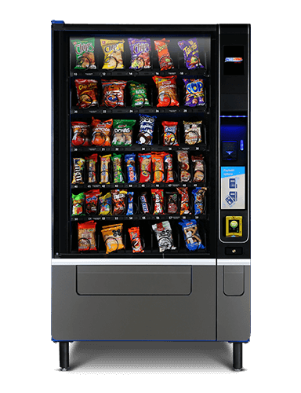
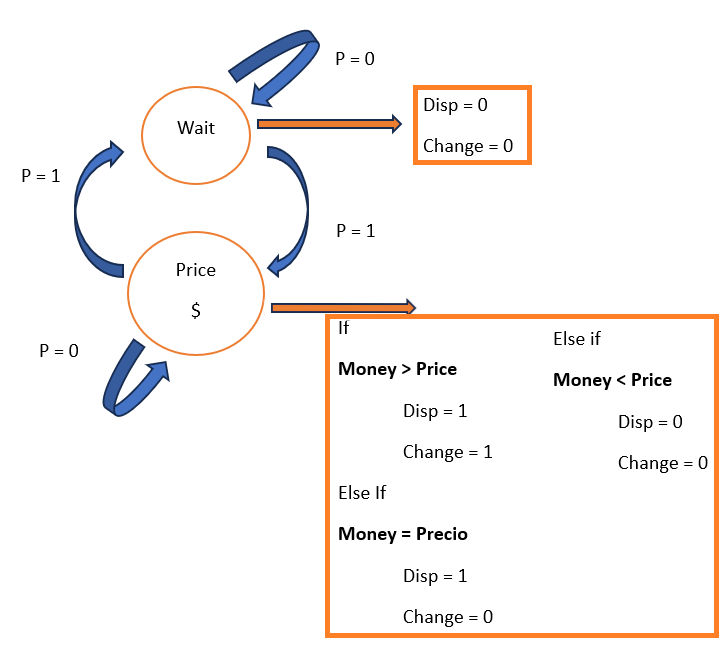
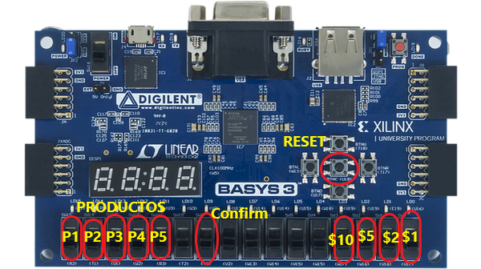

# Vending-Machine-Basys-3-VHDL

   

This is a simulation of the behavior for the hardware of a vending machine in VHDL.

## Project Overview
This project consists of a vending machine capable of offering 5 products of different values and that can receive 4 types of coins (1, 2, 5, 10 MXN). The system of a Basys 3 is designed to help us show the amount of money inserted through two 7-segment displays. A sequential circuit has been implemented to control the operation of the machine.
 
Subsequently, a purchase confirmation button was incorporated, the option to provide change and the display of the total change on two 7-segment displays. These additions allow the user to confirm the purchase, receive the corresponding change, and view the total amount of change in the vending machine.

The Basys 3 is an FPGA (Field Programmable Gate Array) board and stands as one of the most recommended and utilized tools for student training in system development through hardware description. In this project, the internal simulation of a candy vending machine will be carried out, aiming to receive money, dispense the product, and, if necessary, provide change. Prior to this stage, a thorough analysis of the development of a sequential design in VHDL will be conducted, specifically tailored for the Basys 3 board. This analysis will be performed using the EDA Playground development environment in collaboration with the Vivado 2022.2 plugin developed by Xilinx, Inc. To implement the design code for the Basys 3 board, we will use the Vivado 2022.2 software.

  
  
  
## Content List
- [Vending Machine](#vending-machine)  
- [Project Overview](#project-overview)  
- [Requirements](#requirements)
- [VHDL Code Development](#vhdl-code-development)
  - [Main](#main-code)
  - [Frequency Divider](#frequency-divider)
  - [Counter from 0 to N bits](#counter-from-0-to-N-bits)
  - [Debouncer](#Debouncer)
  - [Adder](#Adder)
  - [Product Selector](#Product-Selector)
  - [Change Delivery](#Change-Delivery)
  - [Dispenser States](#Dispenser-States)
  - [Decimal to display 7 segments of units](#Decimal-to-display-7-segments-of-units)
  - [Decimal to display 7 segments of the tens](#Decimal-to-display-7-segments-of-the-tens)
  - [Divide number into tens and units](#Divide-number-into-tens-and-units)
  - [Demultiplexer to show numbers on display](#demultiplexer-to-show-numbers-on-display)
  - [Confirm purchase with LEDS](#Confirm-purchase-with-LEDS)
- [Validation of the EDA Playground Testbench](#validation-of-the-eda-playground-testbench)
- [Extra Configurations](#extra-configurations)
  - [XDC Configuration](#XDC-Configuration)
  - [QSPI Configuration](#QSPI-Configuration)
  - [Running the program](#Running-the-program)
- [Future Improvements](#Future-Improvements)
- [Important Links](#important-links)
- [Contact](#contact)
## Requirements

To run this project you need the following components:

- Vivado (Software).
- EDA Playground (Software).
- Basys 3.

# VHDL Code Development

In this section, the codes that compose this project will be described. All codes of VHDL can be founded on the "CODES VHDL" folder of this repository. 

## Main Code

General structure:
 
Inputs (in):
 
-	clk100Mhz: Main system clock.
 
-	Inputs for the switches, which select the coins of the different possible values: $1, $2, $5, $10. Represented by the switches (UP, DOP, CP, DP). To select the product, 5 switches were used to choose the product to be dispensed. Within the code, it was declared as a vector, with the name (PRODUCT_IN).
 
-	Another of the switches used was to select the product (CONF_COMPRA).
 
-	In order to reset the system, a push button declared within the code as (RST) was used.
 
Outputs (out):
 
-	LEDS: When the purchase is made (the money deposited is equal to or greater than the value of the product), they will be activated in a cascade to inform you that the product has been dispensed.
 
-	seg_display: Output that represents the segments ('a' to 'g') of a seven-segment display.
 
-	select_display: Output indicating which of the four displays should be turn on.
 
Modules and Submodules:
 
-	Frequency Dividers (div_freq):
Generates several clocks divided from the main frequency provided by the clock integrated in the Basys 3 with a frequency of 100 MHz (clk100Mhz).
They are used to create several clocks of different frequencies for different modules. 
 
 
- Debouncer (debouncer):
 Used to prevent button or switches signals from bouncing. (UP, DOP, CP, DP, RST, BUY_CONF).
Provides debounced (UP_IN_SIN_REB, DOP_IN_SIN_REB, etc.) and pulsed signals.
 
 
- Money Adder (money_sum):
 Add up the money received based on the switches activated and monitor the status of the system.
Generates signals such as sign_DineroRecibido and sign_RecibeMinero.
 
 - Number Divisor for Display (divNum_Uni_Dec):
 Divides the number of money, change and price in a decimal form into digits for display on two seven-segment displays.
 
 - Product Selector (select_product):
 Controls the selection of one of the five products and obtains the price of the selected product and the "product_selected" signal that tells you that a product is selected.
 
 - Dispenser States (dispenser_states):
 Control the status of the dispenser based on the money received and price of the selected product, and the signal "product_selected".
 Generates control signals such as signal_Dispense_out and signal_Give_change_out.
 
 - GetChange (get_change):
 Calculates the change that must be delivered to the user.
 
 - Show Dispense LEDs (show_dispense_leds):
 Controls the LEDs based on the dispensing status and purchase confirmation.

- Display demultiplexer (demux_display):
 Controls the display on the seven-segment display depending on the system status.
 
Workflow:
 
-	The code uses multiple split clocks to synchronize different parts of the system.
 
- The debouncer is used to clear signals from buttons and switches.
 
-	The money adder manages the money received.
 
-	The product selector obtains the price of the selected product and the signal that indicates that a product was selected.

- The change module obtains the change that the vending machine has to give.
 
- The status of the dispenser controls the authorization of product delivery and change.
  
-	The demux display module control what is shown in the four seven-segment displays based on the status of the vending machine.

- The show dispense LEDs module activates or deactivates the cascade presentation of the LEDs.

[Back to Top](#top)

## Frequency Divider

The code is divided into two processes, gen_clock and persecond. The gen_clock process is responsible for counting and updating the clock state. When the counter reaches its maximum value (max_count), the clock is inverted (from 0 to 1 or vice versa). The counter is then reset to 0.

The persecond process simply takes the split clock value (clk_state) and assigns it to the clkSplit output signal.

This design has the advantage that the frequency of clkDivided can be easily changed by simply changing the value of max_count. 
To calculate the max_count we need to divided the original clock with frecuency of 100Mhz by the required frecuency, or if you just know how many seconds do you want the clock signal to last you need to divided the original frequency by one over the seconds you want.

   

Additionally, using an event-based account ensures that the split clock has a consistent, well-defined period, which is useful for controlling devices.

The code also includes a reset to reset the counter and split clock signal at any time.

[Back to Top](#top)

## Counter from 0 to N bits

The code is an N-bit counter in VHDL.

The counter starts at 0 and increments by 1 each time the 100 MHz clock (clk_100MHz_counter) goes high (positive clock event).

When "count_enable" is activated, the counter increments its value.

When the counter reaches the maximum value allowed by N bits (2^N - 1), an output signal "terminal_count" is generated.

The output "counter_out" is an N-bit vector representing the current value of the counter.
The output "counter_out_int" is an integer representing the current value of the counter.

The code defines a counter that counts up to the maximum value allowed by N bits and resets itself when this value is reached. It can also be enabled and disabled using the "count_enable" signal. The output of the counter is an N-bit vector and an integer. 

The "terminal_count" signal is activated when the counter reaches its maximum value. This code is used in the function of the debouncer.

[Back to Top](#top)

## Debouncer

This code defines a debouncer module that uses a shift register and a counter to slow down the button read. The debounce logic is based on detecting when the shift register contains only '1'.
 
A "counterNbits" component is used to count the number of clock cycles since the button was last read. This component is initialized with a 20-bit counter.
 
On each clock cycle, the shift register is updated to store the current state of the button and the previous 7 states.
 
If the shift register contains only '1', then the button is considered stable and the module sends a pulse to the "btn_out_reg" output.
 
The "debouncer" module has two flip-flops (ffl and ff2) to store the current state and the previous state of "btn_out_reg". This is used to detect transitions in the button state.
 
The "btn_pulsed" output is activated when there is a transition in the button state (from 0 to 1). This is achieved by applying the "and" operation between the current and previous states of "btn_out_reg" (ffl and ff2, respectively).
 
The "debouncer" module is designed to work with clocks up to 100 MHz and is capable of handling high-speed transitions on the button.

[Back to Top](#top)

## Adder
The sum of money is a module that counts the coins received at a dispenser. To implement this module, we must first create a record that stores the amount of money received so far.

The "moneda_prev" register is updated every time a coin is inserted by one of the four switches that represents them. The variables UP_IN, DOP_IN, CP_IN and DP_IN are used to detect the receipt of coins. When a coin is detected, the "moneda_prev" register is incremented by 1, 2, 5, or 10, depending on the coin that was received.

The "DineroReci" signal is used to inform the rest of the system of the total amount of money received as an integer. This signal is an-output of the module.

 The "RecibeDinero" signal is an-output that indicates whether money has been received or not. It is set to '1' when coins are detected and reset to '0' when no coin is detected or also when the Confirm button is activated.
 
Additionally, an additional signal "RST_IN" is used to reset the money counter. When "RST_IN" is '1', the money counter is reset to 0.

Finally, a process is implemented that manages the flow of information. This process checks if a coin has been detected or the command to reset the money counter has been received. If a coin has been detected, the "moneda_prev" register is incremented based on the currency that was received. If the command to reset the money counter has been received or the Confirm button is activated, the register "moneda_prev" is reset to 0.

In summary, the suma_dinero module counts the coins received at the dispenser. To do this, it uses a register to store the amount of money received and performs increment and reset operations based on input signals indicating the receipt of coins and the command to reset the money counter.
The buttons on the machines register the following data:

- UP_IN – Un peso ($1)
- DOP_IN – Dos pesos ($2)
- CP_IN – Cinco pesos ($5)
- DP_IN – Diez pesos ($10)

[Back to Top](#top)

## Product Selector
The code of the "seleccionar_producto" entity is responsible for reading and saving the product that the user wishes to choose. The entity takes 6 input signals (PRODUCT_1 to PRODUCT_5 and CONFIRMAR_COMPRA) and generates 2 output signals (product_selected and precio_producto).
 
When a product is selected, the "product_selected" signal is activated and the price of the selected product is stored in the "precio_producto" signal.
 
When the CONFIRMAR_COMPRA signal is activated, the product is deselected and the values of the "product_selected" and "product_price" signals are reset.

[Back to Top](#top)

## Change Delivery

The provided code implements a circuit that determines the value of change that should be returned to the user after purchasing a product. This circuit is based on a process that is executed on each edge rise of the clock.
 
When the confirmation signal (Confirm) is activated ('1'), the circuit calculates the value of the change as the difference between the accumulated money (dineroAcumulado) and the price of the product (precioProducto). This value is then stored in the "valor_del_cambio" signal.

[Back to Top](#top)

## Dispenser States

This code represents an FSM (Finite State Machine) that controls the states of a dispenser, in this case the machine es a Moore beacuse the outputs are in the states.

To express the FSM, we use the next diagram:

   

The explanation is the next one:

The state machine changes state whenever a product selection is read, this occurs when selecting a switch of the products. In the “state_Wait” state, the signal for dispensing a product and giving change is set to zero. On the other hand, in the state "state_P_Select" means that there is a selected product and in that state, depending on the money entered and the value of the product, the signals to dispense and give change will be sent depending on whether it is enough, if it exceeds or if it lacks money for The dispense and change signal serves to activate other sections of the code depending on what needs to be done.
 
The code is organized into different logical blocks: STATE_MEMORY, NEXT_STATE_LOGIC and OUTPUT_LOGIC.
 
In STATE_MEMORY, the current state is memorized. The process is synchronized with the clock, so it is updated on each edge rise.
 
In NEXT_STATE_LOGIC, state transition logic is performed. The current state and the selected product signal are evaluated to determine the next state.
 
In OUTPUT_LOGIC, the output logic is realized. The current state is evaluated and the Dispense and Give_Change control signals are activated accordingly.
 
The states and their transitions are defined in the table of the following logical block. For example, if the FSM is in state "state_Wait" and a product is selected (productSelected = '1'), the next state will be "state_P_Select".
 
This code implements a simple FSM that can be extended and adapted to different applications. However, it should be noted that the code only shows a theoretical and conceptual approach to the circuit design, and does not provide information on how to physically implement the circuit on an FPGA or other type of hardware device.

[Back to Top](#top)

## Decimal to display 7 segments of units

The code provided defines a component "bcd7seg_uni" that takes an integer from 0 to 9 as input and returns a 7-bit vector representing the activation of each segment on the 7-segment display.
 
The component logic is implemented within a process block that is executed every time the value of the integer changes. Within the process block, a "segments" variable declaration is used to store the bit pattern that represents the activation of each segment on the 7-segment display.
 
A "case" statement is then used to determine the bit pattern that corresponds to the input integer. Each branch of the case assigns a bit pattern to the segments variable.
 
Finally, the bits of the "segments" variable are connected to the output terminals of the component. This allows the bit pattern representing the activation of each segment on the 7-segment display to be transmitted outside the component.

[Back to Top](#top)

## Decimal to display 7 segments of the tens

The code is a VHDL module that implements a converter from BCD to 7 tens segments. The Behavioral architecture of the module contains a process that performs the conversion according to the BCD-7Seg encoding pattern.
 
The bcd7seg_dec entity has a single input port dec, which receives an integer between 0 and 9. This number represents the ten to be converted.
 
The output port dec_segments is a 7-bit vector output, which represents the 7-segment representation of the tens of the entered number.
 
The module's internal process uses a local variable segments of type std_logic_vector (6 downto 0) to store the conversion result. The conversion is performed using a case statement that evaluates the entered value and assigns the corresponding value to the segments variable.
 
Finally, the process maps each bit of the segments vector to the output port segments_dec, thus completing the implementation of the module.

[Back to Top](#top)

## Divide number into tens and units on two seven-segment displays 

The code you provided divides an integer number into two digits, units and tens. These digits are converted to BCD numbers and displayed on the corresponding 7-segment displays by using the code of Decimal to display 7 segments of units and tens.
 
The process of dividing the number into ones and tens is done within a process block, which is executed every time the value of the number changes. The process block checks to see if the number is 0, in which case the ones and tens are set to 0. If the number is not 0, the ones and tens are obtained using the modulo operation and division.
 
For each BCD digit (units and tens), a "bcd7seg_uni" and "bcd7seg_dec" component is used respectively, which convert the BCD digit into a 7-bit vector that represents the activation of each segment on the 7-segment display.

[Back to Top](#top)

## Demultiplexer to show numbers on display

The code shown is a demultiplexer (demux) that is responsible for controlling which display should turn on. This is achieved using a clock signal (clk1000hz) and a state signal (refresh_state). As we used a frequency clock of 1000 Hz represents that every 0.001 seconds or every milisecond the clock change, so every 2 ms each of the four 7-segment displays is activated

The demux has 4 outputs, which represent the 4 displays in the circuit. To determine which display should be turned on, a process based on a counter is used that runs through all possible state values.

The "show_display" process uses a sequence of 16 possible values for the state, which are divided into 4 substates of 4 values each. Each substate represents a different state that the mux must be in to control which display should turn on.

The demux also uses a register called "display_sel" to store the current display selection. The "curr_display" signal is used to send this information to the outside of the mux.

Additionally, the "show_display" process uses a set of case instructions to determine which values should be shown on the displays based on the current display selection and other input signals (Confirmar_compra_IN).

Finally, it is worth mentioning that the circuit design is based on a demultiplexer with a minimum of components, which facilitates its implementation and reduces costs. However, the use of a register and a counter also involves some consumption of additional resources in terms of time and area.

[Back to Top](#top)

## Confirm purchase with LEDS

This code is responsible for displaying a bit pattern on LEDs after confirming a purchase.
 
Count starts when startCount is high and Confirm_Purchase_IN is also high.
 
When the purchase is confirmed (Confirmar_compra_IN is high), it counts to 18, then activates signal_endCount and increases countNumber by 1.
 
The LEDs show an ascending bit pattern, achieving a cascade effect, where the LEDs turn off from the largest LED (15) to the smallest (0).
 
When signal_endCount is high, LEDS is set to zero. 

[Back to Top](#top)
  
# Validation of the EDA Playground Testbench

Before implementing the code on the Basys 3, you can use a testbench code to test the correct fuction of the project.

In the files provided for this project, you can find a VHDL code that has the purpose to be used as a testbenh. You can use it in the compiler of your election.

However, with the next link, you can instantly use it with EDA Playground. Just type the conditions you want:

https://edaplayground.com/x/BD4G

[Back to Top](#top)
# Extra Configurations

In order to implement this project on a Basys 3, you must use the Vivado software.

In our case, we use version 2022.2 (This is the one in which the project is located in the folder), so if you want to directly open the project, you will need that version.

If you want to use another version, just start a new project and configure it in the usual way, and when adding the design sources, simply add the shared VHDL codes.

### XDC Configuration

In order to indicate to the FPGA which components it will use, a constrain file, in the XDC format, must be used.

For convenience, you can simply add the shared XDC to the code folder.

But if you want to do it manually, you must follow the following steps:

- You must first activate the FPGA's built-in clock:

   

- The next step is to configure the LEDs. They are all activated since the code requires it.

   

   

- Now, is time to set the switches that will control what product will be chosen.

   

- And finally, add the push button for the reset and the switches that will control the value of the coins inserted.

   

Remember, if you want to change the name of the components declared on the XDC, you also must change their name in the VHDL codes.

[Back to Top](#top)

## QSPI Configuration

To implement the program on the QSPI memory, the next steps must be followed:

- Step 1: Connect pins J9 and J10

Pins J9 and J10 of the Basys 3 are connected to the QSPI memory controller of the FPGA. To configure the Basys 3 for QSPI programming mode, it is necessary to connect these pins to a QSPI programmer. The QSPI programmer must provide power to the Basys 3.

   

- Step 2: Open QSPI programming software

For this section, we will right-click on the option shown in the image and then select "Add Configuration Memory Device."

   

Later, we will consult the Basys 3 manual; If you want more information, you can go to the "Important Links" section. Once in the manual, we will review the manufacturer; in the case of this Basys, it is (Spansion part number S25FL032). Next, we will check how many megabytes (MB) you have; In this case, there are 32. 

   

After adding this information, we will be presented with two options. We will choose the one that says "Family: s25flxxxp" and click "OK".

   

With this, the file will be ready and the next thing we must do is verify that the boxes:

- Erase
- Program
- Verify

Are activated and then click on the "Apply" button. In the "Configuration File" section, click the three dots (...) and navigate to the projects you created. Go to the folder with the file extension ".runs" and find the deployment files. After that, select the one you want to save.

   

- Step 3: Click the "Program Device" button
 
Click the "Program" button to load the file into the ROM. The programming process may take a few minutes.

   

## Running the program
Now that we have made the extra configurations, we can run and test the program with the Basys 3.

If you used the QSPI configuration to save it in the internal memory of the FPGA, you will only need to press the SET button to call the code and wait for the code to be active.

Since we verify that the code is active (the green LED is on), all that remains is to try to enter money, select a product and confirm the purchase.

Click on the image to see a video of it working on the Basys 3.

  

Now, you can try any combination you want.

   

## Future Improvements

Once you run the program, you can see that, although we have entered money, when selecting the product and confirming the purchase, the product dispensing LEDs will not light up, but a value will be displayed in the change. This is because a smaller quantity is entered than the selected product.
 
To address this issue, a sign can be installed indicating that the vending machine will only accept the exact quantity or value greater than the selected product. If you enter a lower amount, the machine will retain the money and no refund will be made.
 
Another possible solution is that the error is due to the fact that the comparison in the code between the cost of the product and the money entered does not consider the scenario in which the amount entered is less than the cost necessary to dispense the product. As a result, the code cannot determine which process to follow, which prevents the dispensing indicator LEDs from turning on and the system does not function as expected.
 
A new scenario could be programmed in which the money is returned if the amount entered is less than what is necessary to purchase the product. I invite the reader to try both this solution and the previous one to optimize the project, highlighting a clear action for the user or the possibility of improving the code.

## Important Links
For the VHDL compiler, you can use this website to work on it :

https://edaplayground.com/

For the testbench online, access this link:

https://edaplayground.com/x/R4By

For extra information about the QSPI implementation, you can check this link:

https://youtu.be/5pV0R82A_CE?si=vsrD9TKzp-9_Ht8v

For the Basys 3 Reference Manual:

https://digilent.com/reference/programmable-logic/basys-3/reference-manual

Also, other source where more information about VHDL configuration can be found is the the following book:

https://issuu.com/umbrella12/docs/2019_book_quickstartguidetovhdl

If you want to install Vivado:

https://www.xilinx.com/support/download.html

To be able to see a video of its operation on the Basys 3:

https://www.youtube.com/watch?v=2hHGZxMNnmc

[Back to Top](#top)

## Contact 
Authors:

Ricado Ramos Morales - ricardo.ramosms@udlap.mx - Github: [ricardoRamoM](https://github.com/ricardoRamoM)

Adriel Ivann Ferrer Alejo - adriel.ferrerao@udlap.mx - Github: [IvannFerrer](https://github.com/IvannFerrer)

Irving Alejandro Vásquez Salinas - irving.vasquezss@udlap.mx - Github: [IrvingVasquez3](https://github.com/IrvingVasquez3)

Project Link: https://github.com/ricardoRamoM/Vending-Machine-Basys-3-VHDL

# And remember... Enjoy, entertain, and improve: Motivate yourself, design and program!
